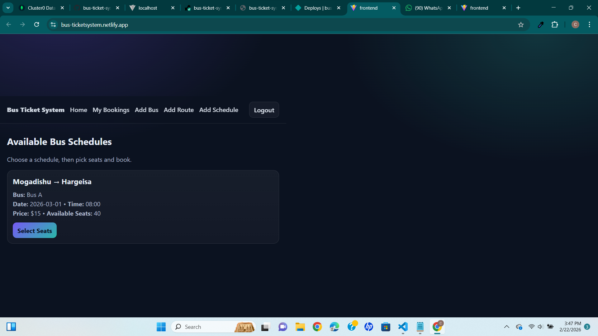
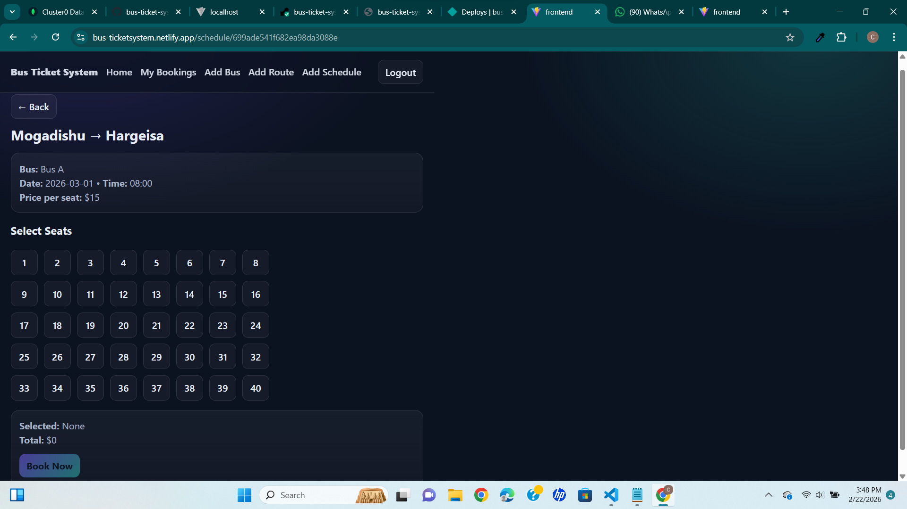
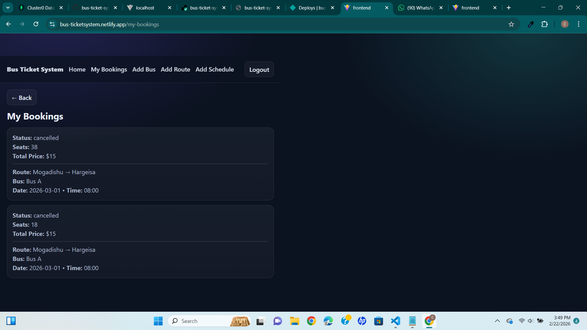
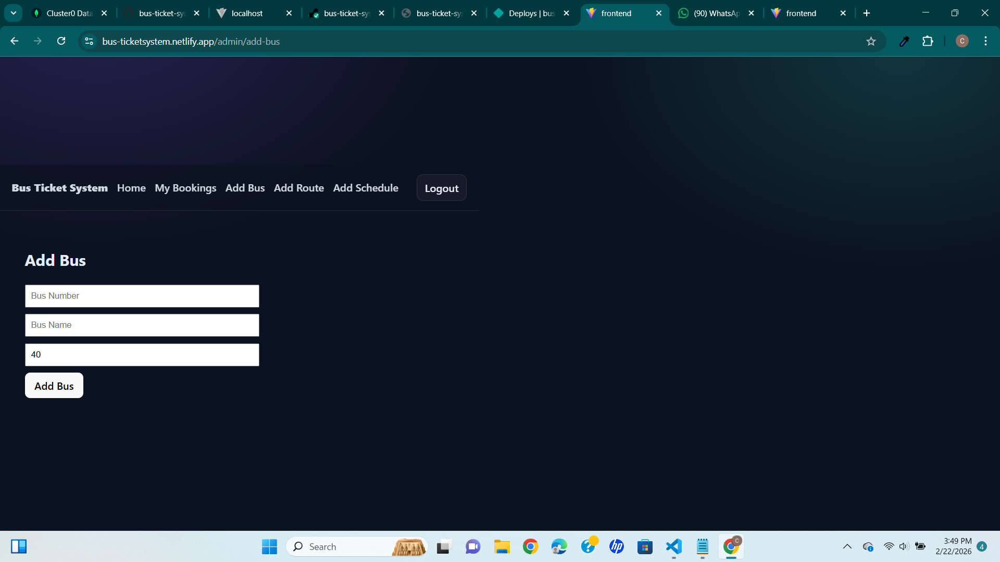
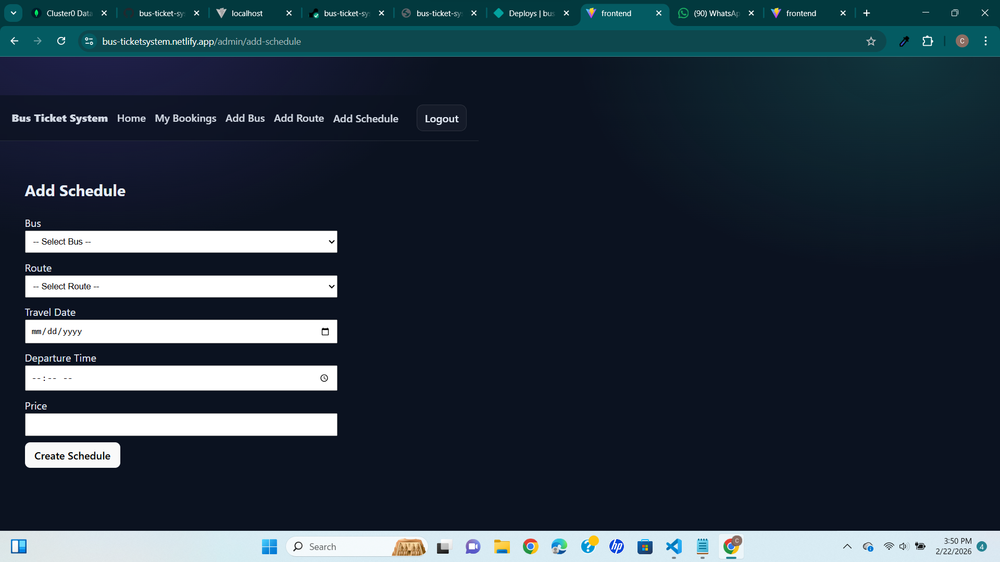
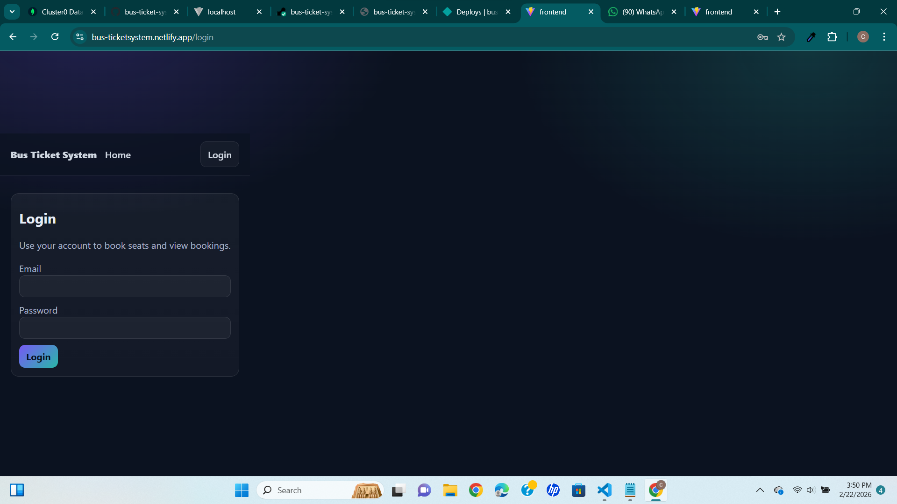

# 🚌 Bus Ticket Booking System (MERN Stack)

A full-stack **Bus Ticket Booking System** built using the **MERN stack** (MongoDB, Express, React, Node.js).  
The system allows users to view bus schedules, select seats, book tickets, and manage bookings, while administrators can manage buses, routes, and schedules.

---

## 🌐 Live Links

- **Frontend (Netlify):** https://bus-ticketsystem.netlify.app  
- **Backend API (Render):** https://bus-ticket-system-jytd.onrender.com  

---

## ✨ Features

### 👤 User Features
- User registration & login (JWT authentication)
- View available bus schedules
- Select seats visually
- Book tickets
- View personal bookings
- Cancel bookings

### 🛠 Admin Features
- Add buses
- Add routes
- Create schedules
- View all system data
- Role-based access control (Admin only)

---

## 🧱 Tech Stack

### Frontend
- React (Vite)
- React Router
- Axios
- CSS (Custom Dark Theme)
- Netlify (Deployment)

### Backend
- Node.js
- Express.js
- MongoDB (Atlas)
- Mongoose
- JWT Authentication
- Render (Deployment)

---

## 🔐 Security
- Passwords hashed using bcrypt
- JWT authentication with protected routes
- Environment variables used for sensitive data
- Role-based authorization for admin routes

---

## 📸 Screenshots

### Home – Available Schedules


### Seat Selection


### My Bookings


### Admin – Add Bus


### Admin – Add Schedule


### Login Page


---

## ⚙️ Installation (Local Setup)

### Backend
```bash
cd backend
npm install
npm run dev